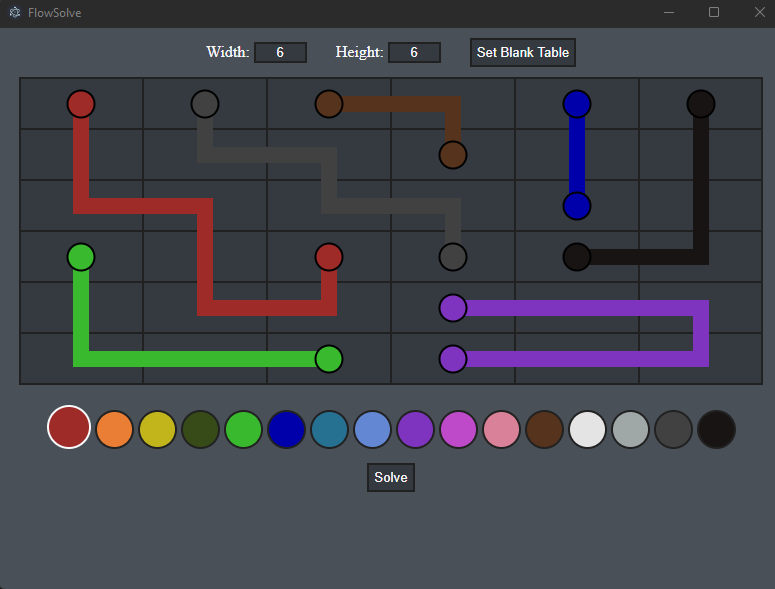

# Flow Solver

Naive bruteforce solver for Flow puzzles. Locally hosted and ran on Electron Desktop Application.

## Tech Used

**Client:** HTML, JavaScript, CSS

**Server:** Node, Electron

## Authors

- [Jacob Rose (@jrose0116)](https://www.github.com/jrose0116) - Front-end Design (HTML, CSS), Pathfinding, Event Handling, User Interface

### Extra Help
- [Elliot Topper (@xaridar)](https://www.github.com/xaridar) - Combination Handling and CSS

## Issues

This application was created in rushed time and used bruteforce methods to find the solution. Because of this, the application runs extremely slow when many paths are present for each color. The fastest solutions are generally very small boards or very compact/blocked off paths on larger boards. This works great for 5x5 to 6x6 puzzles but will require alot of computation power for larger models.

Most of the effort went into the front-end. Feel free to contact me at my email [Jrose0116@gmail.com](mailto:jrose0116@gmail.com)
